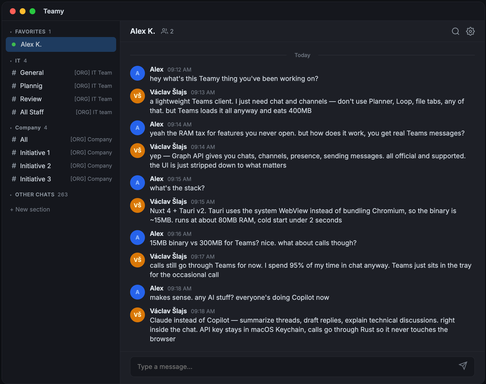

# Teamy

A lightweight Microsoft Teams **chat client** built with Nuxt 4 and Tauri 2.

Teamy is a chat-only alternative to the official Microsoft Teams desktop app. It covers the 90% use case -- reading and sending messages -- with a fraction of the RAM (~80 MB vs 300-500 MB). Calls, meetings, calendar, files, and other non-chat features are delegated to the official Teams app via deep links. It connects directly to Microsoft Graph API via Azure Entra ID, with no server or proxy needed.



## Prerequisites

- [Bun](https://bun.sh/) runtime
- [Rust](https://www.rust-lang.org/tools/install) toolchain (for Tauri)
- Azure Entra ID app registration with Microsoft Graph permissions

## Setup

```bash
bun install
```

Copy `.env.example` to `.env` and fill in your Azure credentials:

```bash
cp .env.example .env
```

### Azure App Registration

1. Create an app registration in [Azure Entra ID](https://entra.microsoft.com/)
2. Under **Authentication**:
   - Add **Single-page application** platform
   - Add redirect URIs: `http://localhost:3000` (dev), `http://localhost` (Tauri production)
   - Enable **Allow public client flows**
3. Under **API permissions**, add the delegated Microsoft Graph scopes listed below
4. Copy the **Application (client) ID** and **Directory (tenant) ID** to your `.env`

### Required Microsoft Graph permissions (delegated)

- `Chat.ReadWrite` -- read/send chat messages
- `ChannelMessage.Read.All` -- read channel messages
- `ChannelMessage.Send` -- send channel messages
- `Team.ReadBasic.All` -- list joined and associated teams
- `Channel.ReadBasic.All` -- list channels
- `Presence.Read.All` -- user presence/status
- `People.Read` -- people search

## Development

```bash
# Web only (browser)
bun run dev

# Tauri desktop app
bun run tauri:dev
```

## Build

```bash
# Web
bun run build

# Tauri desktop app
bun run tauri:build
```

## Architecture

- **Frontend**: Nuxt 4 (SPA mode, SSR disabled), Nuxt UI v4, Vue 3
- **Desktop**: Tauri 2 (Rust) -- no bundled server, pure static frontend
- **Auth**: MSAL Browser (popup flow in browser, custom OAuth2 PKCE with native Tauri window on desktop)
- **API**: Microsoft Graph API called directly from client (no server proxy)
- **AI**: Claude integration via Rust commands with macOS Keychain-stored API key (optional)
- **State**: Composables with module-level shared refs, Pinia for stores

### Key directories

```
app/
  components/     # Vue components (auto-imported, no path prefix)
  composables/    # Shared composables (useGraph, useAuth, useMessages, etc.)
  pages/          # File-based routing (index, chat/[chatId], channel/[teamId]/[channelId])
  plugins/        # Client plugins (msal.client.ts)
  utils/          # Utilities (msalConfig.ts, auto-imported)
types/            # TypeScript type definitions
src-tauri/        # Tauri desktop shell (Rust)
  src/commands/   # Tauri commands (auth, claude, keychain, deeplink, notifications)
```

## Roadmap

### Milestone 1: Core Teams Client (current)

- Azure Entra ID authentication (MSAL browser + Tauri-native OAuth2 PKCE)
- Chat list with unread counts and last message preview
- Real-time chat messaging with rich text, inline images, and replies
- Channel browsing across joined and associated teams
- Channel messaging with reply threads
- User presence and status indicators
- People search
- Customizable sidebar sections (favorites, groups)
- Dark/light theme with Nuxt UI v4
- Desktop notifications (Tauri)
- Deep link handling for Teams URLs
- Basic Claude AI assistant with streaming chat (Tauri only, Keychain-stored API key)

### Milestone 2: Claude Agent SDK Integration

- Replace direct Anthropic API calls with Claude Agent SDK
- AI-powered chat summarization (unread messages, long threads)
- Smart reply drafting based on conversation context
- Message translation
- Intelligent search across chats and channels
- Meeting notes extraction from chat history
- Action item detection and tracking

### Milestone 3: Self-Evolving App via Claude Agent SDK Skills

- Plugin system powered by Claude Agent SDK skills
- Users describe desired functionality in natural language, Claude generates and installs plugins
- Auto-generated sidebar panels, message actions, and slash commands
- Claude can modify and improve its own plugins based on user feedback
- Self-improving workflows that adapt to user patterns over time

## Not Supported (by design)

Teamy is a chat-only client. The following are delegated to the official Teams app via deep links:

- Audio/video calls and meetings
- Calendar
- Files and SharePoint
- Apps marketplace, Copilot, Viva, Loop

## Known Limitations

- **Channel unread messages** -- Microsoft Graph API does not expose unread counts or read state for channel messages. There is no workaround available.
- **Incoming call notifications** -- Graph API does not support real-time call event notifications for client apps (requires server-side subscriptions not available in delegated context).
- **Calling / joining meetings** -- Uses deep links to open calls and meetings in the official Microsoft Teams web/desktop client. Native calling is not supported.
- **Sidebar sections** -- Custom sections (favorites, groups) are stored locally per device and not synced with Microsoft Teams or across devices.
- **Real-time updates** -- Polling-based (5s active chat messages, 10s chat list). No WebSocket or push notifications.
